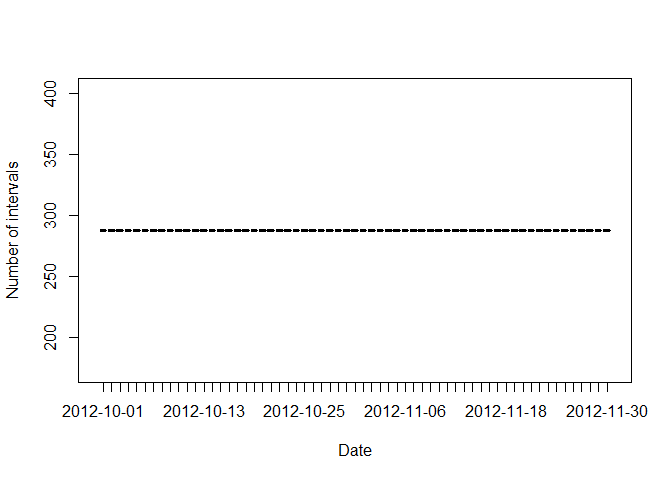
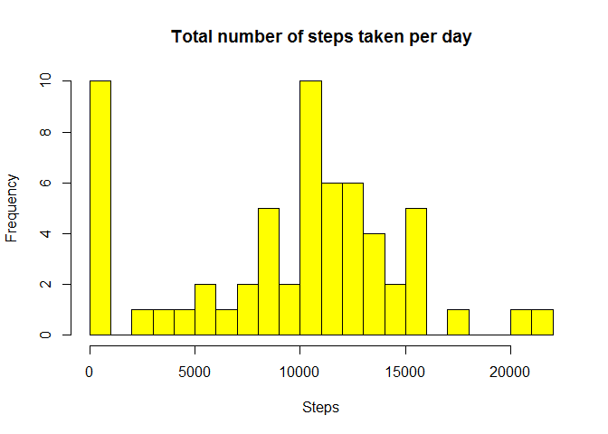
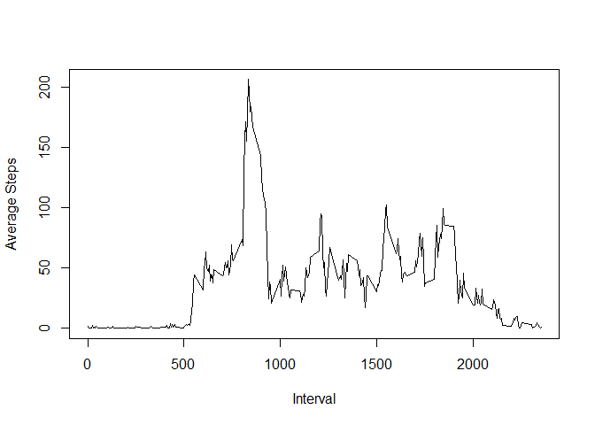
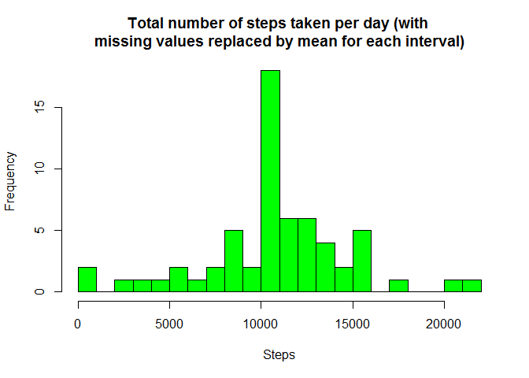

# Reproducible Research: Peer Assessment 1


## Loading and preprocessing the data


**Loading the dataset**

We first Include libraries dplyr, chron, and lattice, to be used for analysis and processing of the data. Next, we download the activity.csv file in the working directory, and read the file in R. 


```r
library(dplyr)
```

```
## 
## Attaching package: 'dplyr'
## 
## The following objects are masked from 'package:stats':
## 
##     filter, lag
## 
## The following objects are masked from 'package:base':
## 
##     intersect, setdiff, setequal, union
```

```r
library(chron)
library(lattice)

df <- read.csv("./activity.csv",header=TRUE)
```


**About the dataset**

As per the instructions, this file is a dataset for Activity monitoring data
with the following variables:

* **steps**: Number of steps taking in a 5-minute interval (missing values are coded as NA)

* **date**: The date on which the measurement was taken in YYYY-MM-DD format

* **interval**: Identifier for the 5-minute interval in which measurement was taken

*This data has been collected from an activity monitoring device at 5 minute intervals through out the day. The data consists of two months of data from an anonymous individual collected during the months of October and November, 2012 and include the number of steps taken in 5 minute intervals each day.*


**Inspecting, verifying, and preprocessing the data**

Visually inspect the data using "View" to spotcheck. 
Understand the structure of the data. As an example, are the interval numbers
the same for all days? Are the records missing partially for a day or an entire day? etc.


```r
# check the data set structures
str(df)
```

```
## 'data.frame':	17568 obs. of  3 variables:
##  $ steps   : int  NA NA NA NA NA NA NA NA NA NA ...
##  $ date    : Factor w/ 61 levels "2012-10-01","2012-10-02",..: 1 1 1 1 1 1 1 1 1 1 ...
##  $ interval: int  0 5 10 15 20 25 30 35 40 45 ...
```

```r
# visually inspect the dataset
View(df)

# understanding the data
# Are there same number of rows for each day?
byDate <- group_by(df,date) 

# get total number of records by each day to check if the number 
# of intervals for each day are same or not
rowCountByDate <- tally(byDate)

# this proves that each day has the same number of intervals
plot(rowCountByDate$date, rowCountByDate$n, type="l", 
  xlab="Date", ylab="Number of intervals")
```

 


## What is mean total number of steps taken per day?

For this part of the assignment, we ignore the missing values in the dataset.

**1.First, we calculate the total number of steps taken per day**


```r
# calcuate the total number of steps taken per day 
byDateSum <- group_by(df,date) %>% 
		summarize(totalSteps = sum(steps, na.rm=TRUE)) 
```

**2.Second, we plot a histogram of the total number of steps taken each day**


```r
# histogram of total number of steps taken per day
hist(	byDateSum$totalSteps, breaks=20,
	main="Total number of steps taken per day", 
	xlab="Steps", col="yellow") 
```

 

**3.Third, we calculate and report the mean and median of the total number of steps taken per day**


```r
# calculate mean and median of total number of steps taken per day
summarize(byDateSum, meanTotalStepsPerDay = mean(totalSteps), 
		medianTotalStepsPerDay = median(totalSteps))
```

```
## Source: local data frame [1 x 2]
## 
##   meanTotalStepsPerDay medianTotalStepsPerDay
##                  (dbl)                  (int)
## 1              9354.23                  10395
```


## What is the average daily activity pattern?
For this part, we do the following:

**1.Make a time series plot**

The time series plot (i.e. type = "l") will be the 5-minute interval (x-axis) vs. the average number of steps taken, averaged across all days (y-axis)


```r
# time series plot of 5 min interval and steps taken across all days
byInterval <- group_by(df,interval) %>% 
		summarize(averageSteps = mean(steps, na.rm=TRUE))
plot(byInterval$interval, byInterval$averageSteps, type="l",
	xlab="Interval", ylab="Average Steps")
```

 


**2.Answer the question "Which 5-minute interval, on average across all the days in the dataset, contains the maximum number of steps?"**

ANSWER: The 5-min interval is:  

```r
# calculate the 5 min interval with the max average 
# number of steps across days
byInterval[which(byInterval$averageSteps==max(byInterval$averageSteps)),"interval"]
```

```
## Source: local data frame [1 x 1]
## 
##   interval
##      (int)
## 1      835
```

The corresponding maximum number of steps on average across all days is:

```r
max(byInterval$averageSteps)
```

```
## [1] 206.1698
```


## Imputing missing values
For this part, we first calculate and report the total number of missing values in the dataset (i.e. the total number of rows with NAs). 

```r
# total number of missing values (coded as NA) in the dataset
count(df[!complete.cases(df),])
```

```
## Source: local data frame [1 x 1]
## 
##       n
##   (int)
## 1  2304
```

Then we do the following:

**1.Devise a strategy for filling in all of the missing values in the dataset.** 

The strategy we adopt here is to update the missing values for the steps with the mean of the corresponding interval across all days. To do this, we first make a copy of the dataset into a new one, and update the missing values based on the matching interval value from the other dataset ordered by interval. 


**2.Create a new dataset that is equal to the original dataset but with the missing data filled in.**

```r
# make a copy of the data into a new data set
dfNew <- df

# loop thru the rows to remove the missing values, based on the interval
# matching from the byInterval dataset
for(i in 1:nrow(dfNew)){
	if (is.na(dfNew[i, "steps"])) {
		x <- dfNew[i, "interval"]
		dfNew[i, "steps"] <- byInterval[which(byInterval$interval==x),"averageSteps"]
	}
}

# calcuate the total number of steps taken per day for the new dataset
byDateSumNew <- group_by(dfNew,date) %>% 
		summarize(totalSteps = sum(steps, na.rm=TRUE)) 
```


**3.Make a histogram of the total number of steps taken each day and calculate and report the mean and median total number of steps taken per day.**


```r
# histogram of total number of steps taken per day
hist(	byDateSumNew$totalSteps, breaks=20,
	main="Total number of steps taken per day (with 
	missing values replaced by mean for each interval)", 
	xlab="Steps", col="green")
```

 

```r
# calculate mean and median of total number of steps taken per day 
# for new dataset
summarize(byDateSumNew, meanTotalStepsPerDay = mean(totalSteps), 
		medianTotalSteps = median(totalSteps))
```

```
## Source: local data frame [1 x 2]
## 
##   meanTotalStepsPerDay medianTotalSteps
##                  (dbl)            (dbl)
## 1             10766.19         10766.19
```

**4.Answer the question "Do these values differ from the estimates from the first part of the assignment? What is the impact of imputing missing data on the estimates of the total daily number of steps?"**

ANSWER: Yes, with the imputation of missing values, we see that the mean and median values have increased from before.


## Are there differences in activity patterns between weekdays and weekends?

For this part, we divide the dataset into two, one for weekend and the other for weekday, based on the date values. We then panel plot the data between for weekend and weekday to observe differences. The Number of steps (y axis) for each 5 min interval (x axis) are plotted.


```r
# add a column to the dataset indicating if date is a weekend or not
dfNew$weekend <- is.weekend(as.Date(dfNew$date))

# average the data over intervals for weekends and weekdays
dfWeekend <- filter(dfNew,weekend==TRUE) 
dfWeekend <- group_by(dfWeekend,interval) %>% summarize(meanSteps = mean(steps)) 
dfWeekend$daytype <- "weekend"
dfWeekday <- filter(dfNew,weekend==FALSE) 
dfWeekday <- group_by(dfWeekday,interval) %>% summarize(meanSteps = mean(steps))
dfWeekday$daytype <- "weekday"

# combine the data for plotting
dfplot <- rbind(dfWeekend, dfWeekday)

# panel plot the weekend and weekday data columnwise
xyplot(meanSteps~interval | daytype, dfplot, type="l", layout=c(1,2), 
       xlab="Interval", ylab="Number of steps")
```

 
